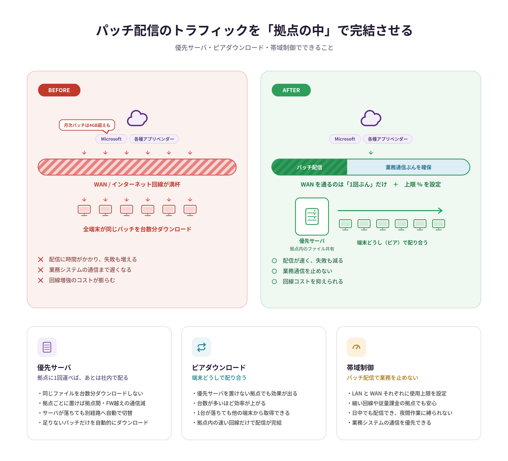

# 図版デザイン規約

`neurons-poc-guide` に掲載する図版の作成ルール。
新しい図を作るとき（Claude Design / Claude への依頼時）は、このファイルを渡すこと。

## ファイル構成

| パス | 内容 |
| --- | --- |
| `diagrams/src/*.svg` | **原本**。編集はここに対して行う |
| `diagrams/build.py` | 書き出しスクリプト |
| `docs/assets/images/*@2x.png` | 書き出し結果。手で編集しない |

PNG は自動生成物のため、原本を直さずに PNG だけ差し替えないこと。

## カラーパレット

| 用途 | 値 |
| --- | --- |
| ブランド基調（パープル） | `#5B2A87` |
| 見出しテキスト | `#241B33` |
| 補足テキスト | `#6B6B7B` |
| 本文テキスト | `#444444` |
| ポジティブ（グリーン） | `#2E9E5B` / 濃 `#1F7A46` |
| 警告（レッド） | `#C0392B` / 線 `#D9534F` |
| アクセント（ティール） | `#0E7C86` |
| アクセント（アンバー） | `#A8720F` |
| 罫線・カード枠 | `#E3DFEC` |

淡色背景は基調色を薄めたもの（`#F3EEFA` / `#E9F5F6` / `#FCF1DC`）を使う。

## タイポグラフィ

```
font-family: 'Noto Sans JP','Noto Sans CJK JP','Hiragino Sans','Yu Gothic',Meiryo,sans-serif
```

| 要素 | サイズ / ウェイト |
| --- | --- |
| 大見出し | 30px / 700 |
| リード文 | 15px / 400 |
| セクション見出し | 16px / 700 |
| 図中ラベル | 12〜13.5px / 700 |
| 本文・箇条書き | 12.5〜13px / 400 |
| 補助ラベル | 10〜10.5px |

## サイズ

- 基準幅 1200px（16:9 スライドにも収まる比率）
- 書き出しは `@2x`（幅 2400px）
- カード角丸 16px、パネル角丸 20px、チップ角丸 10px

## 禁止事項

### 記号を文字で描かない

`✕`（U+2715）のように日本語フォントに未収録の記号がある。
チェックマーク・バツ・丸などは **`<path>` や `<circle>` で描画**すること。

```xml
<!-- NG -->
<text>✕</text>
<!-- OK -->
<path d="M1 1 L11 11 M11 1 L1 11" stroke="#C0392B" stroke-width="1.9" stroke-linecap="round"/>
```

### 影を多用しない

`filter` による影は PowerPoint への貼り付けで崩れる。枠線で表現する。

### ラスター画像を埋め込まない

SVG 内に base64 画像を入れない。ファイルが肥大し差分も追えなくなる。

## ダークモード

図はライト版のみを用意する。MkDocs Material の slate スキームでは白背景のカードとして表示される。
輝度が気になる場合は CSS 側で調整する。

```css
[data-md-color-scheme="slate"] .md-typeset img { filter: brightness(0.92); }
```

## 掲載方法

```markdown
{ width="1000" }
```

`alt` は図の内容が伝わる説明にする（PNG のため文字は検索・読み上げの対象外になる）。
