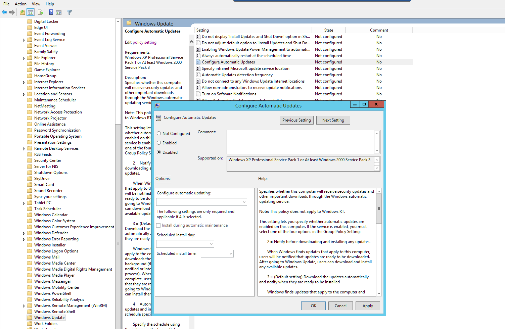
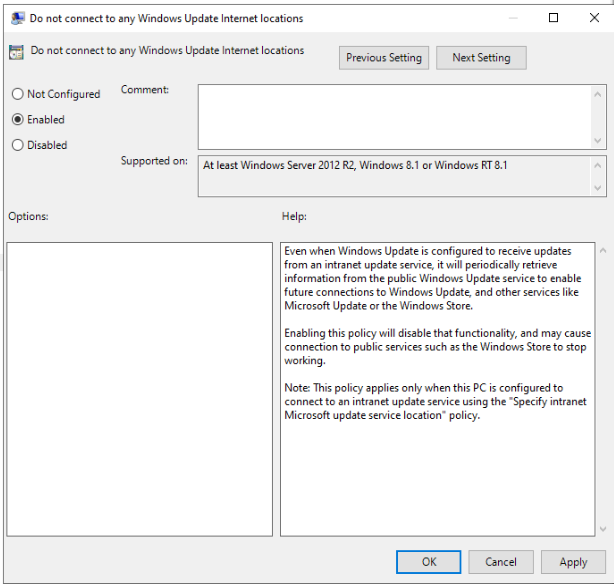
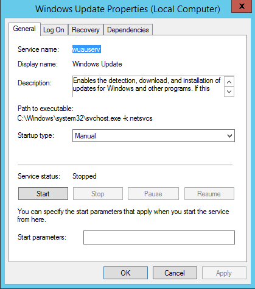
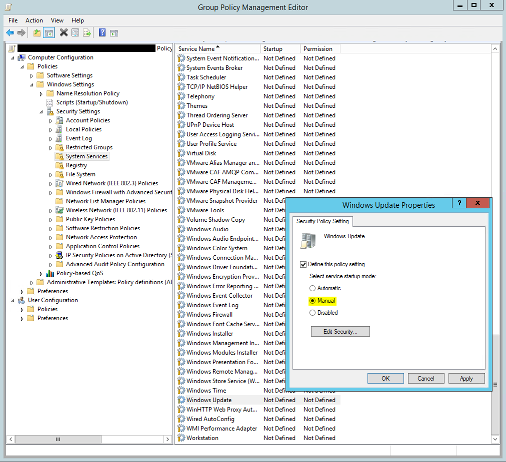
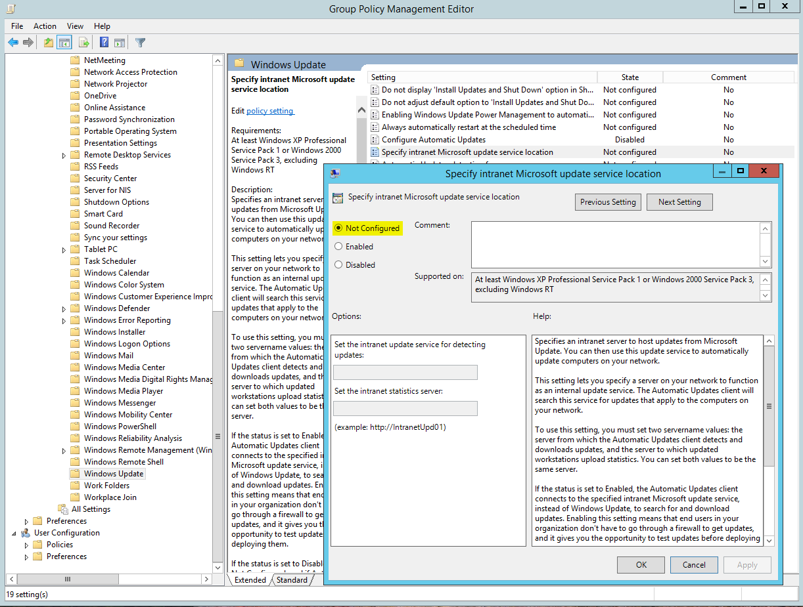

# パッチ要件

Windows の自動更新機能(Windows Update)が有効なままだと、更新の確認処理(ダウンロード・インストールを行わない設定であっても)が原因で、Ivanti によるパッチ配布が遅延する場合があります。POC でパッチ管理を検証する対象デバイスでは、事前に以下の設定を行ってください。

!!! info "参照元"
    - [Best Practice: Windows Automatic Updates](https://hub.ivanti.com/s/article/Best-Practice-Windows-Automatic-Updates?language=en_US)

---

## 推奨設定

### 1. GPO で自動更新を無効化する

**自動更新の構成**

1. **[スタート]** > **[ファイル名を指定して実行]** を開く
2. `gpedit.msc` と入力して **OK**
3. **[コンピューターの構成]** > **[管理用テンプレート]** > **[Windows コンポーネント]** > **[Windows Update]** を展開する
4. **[自動更新を構成する]** を選択し、**[無効]** に設定して **OK**
5. GPO は既定で 90 分ごとに反映されるため、以下のコマンドで即時反映できる

   ```
   gpupdate /force
   ```



**Windows Update のインターネット接続先に接続しない**

1. **[スタート]** > **[ファイル名を指定して実行]** を開く
2. `gpedit.msc` と入力して **OK**
3. **[コンピューターの構成]** > **[管理用テンプレート]** > **[Windows コンポーネント]** > **[Windows Update]** を展開する
4. **[Windows Update のインターネットの場所に接続しない]** を選択し、**[有効]** に設定して **OK**
5. GPO は既定で 90 分ごとに反映されるため、以下のコマンドで即時反映できる

   ```
   gpupdate /force
   ```



!!! note
    このポリシーを有効にすると、Windows Update クライアントが Microsoft の公開更新サーバー(Windows Update / Microsoft Update)へ接続できなくなり、社内の WSUS サーバーなど内部の更新管理ソリューションのみに依存するようになります。この設定が影響するのは Windows Update クライアントの接続のみで、他のアプリケーションやサービスのインターネット アクセスには影響しません。

### 2. Windows Update サービスを停止・無効化する

- 対象デバイス上で `services.msc` を開き、**Windows Update** サービスを右クリック → **[プロパティ]** を選択
- サービスを一旦停止し、**スタートアップの種類** を **[手動]** に変更して **[適用]** / **OK**



- GPO で一括設定する場合: **[コンピューターの構成]** > **[ポリシー]** > **[Windows の設定]** > **[セキュリティの設定]** > **[システム サービス]** で **Windows Update** をダブルクリックし、**[このポリシー設定を定義する]** をチェックした上で **[手動]** を選択して **[適用]** / **OK**



### 3. イントラネット Microsoft Update サービスの場所指定を解除する

グループ ポリシー エディターの **[コンピューターの構成]** > **[管理用テンプレート]** > **[Windows コンポーネント]** > **[Windows Update]** にある **[イントラネット Microsoft 更新サービスの場所を指定する]** が設定されている場合は、**[未構成]** に変更してください。



---

## 設定後の確認

- 対象デバイスで `services.msc` を開き、Windows Update サービスのスタートアップの種類が **[手動]**(かつ停止状態)になっていることを確認する
- `gpupdate /force` 実行後、`gpresult /h report.html` などでポリシーが適用されていることを確認する
